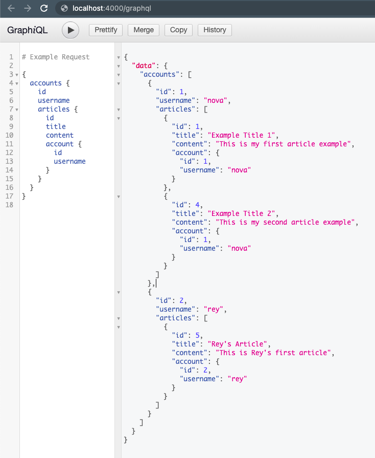

# learn-express-postgresql-graphql

<p align="center">

</p>

```npm start``` to start the server then open http://localhost:4000/graphql to test the queries (Make sure your local database running and in the right configuration as the config in server.js)